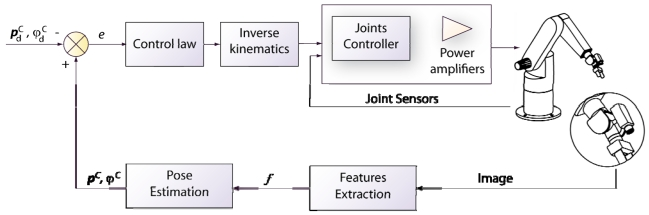

# Robotics_MA4825

 **Acknowledge this page if u used the script**

* Hand guesture to control the base of the robot
* Visual servoing with image feedback from a webcam

 *2 independant system*

## Visual servoing with a robotic arm



1. YOLO for object detection
2. Inverse kinematics using optimization to control the arm

### Hardware used
 1. 2 x dynamixel ax-12 for the base, 2 x dynamixel ax-12 and 2 x dynamixel ax-18 for the arm
 2. webcam at the front of the body
 3. A handphone to get image for hand guesture control

#### Final script is under combine folder

To excecute:
```python
python combine_arm_wheel.py
```

 Installing dependencies

```
pip install -r requirements.txt
```
